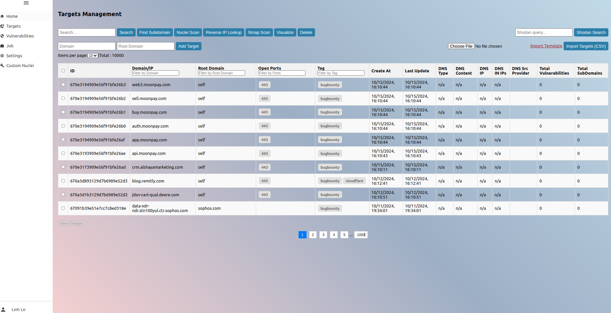
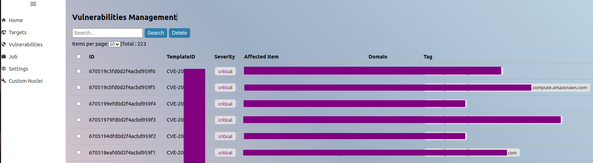

# About
Eagle is designed to simplify your asset and vulnerabilities management and boost your workflow efficiency




# Major Features
- *Automated Asset Collection*: Gather IPs, domains, and other internal digital assets from platforms like Cloudflare, AWS Route53, Digital Ocean, with flexible options to add, edit, delete, and import assets.
- *Periodic Open Port Detection*: Automatically scan assets for open ports on a regular basis, with instant alerts sent to Slack.
- *Custom Nuclei Scanning*: Run comprehensive Nuclei scans on all assets or define custom scans using your own Nuclei templates.
- *Subdomain Discovery*: Effortlessly collect subdomains for any domain.
- *DNS Dangling Detection*: Identify and alert on dangling DNS records to help prevent subdomain takeover attacks.
- *Host Collection via Shodan*: Collect host information using Shodan for deeper insights into exposed assets.
- *Reverse IP Lookup*: Discover domains associated with an IP address.

# How it works
Eagle consits 3 major components
1. Backend API base on Flask with Gunicorn as webserver and Mongodb as database
2. Frontend base on React Native
3. Reverse proxy via Nginx

# Setup
## Frontend
- Replace your api endpoint (apiEndpoint) at `/eagle/frontend/src/config.js` file
- Build
```
nvm use 16
npm run build
```
build folder will be served by nginx (/etc/nginx/sites-available/[your domain])
```
...
        root /home/linhle4/eagle/eagle/frontend/build;
        try_files $uri /index.html;
...
```
see nginx config section below for details
## Backend

### Install requirements
- Install requirements for Flask Python Backend
```
cd backend
source venv/bin/activate
pip install -r requirements.txt
```
- Install engine dependencies
    - nuclei
    - subfinder
    - nmap
### Env variables
Set multiple env variables options in backend/.env file

```
cd eagle
cp backend/.copy.env backend/.env
```
### Database
Install mongodb follow the instructions (https://www.mongodb.com/docs/manual/tutorial/install-mongodb-on-ubuntu/)
### Gunicorn
1. Install Gunicorn
```
pip install gunicorn
```
2. Create a Gunicorn Systemd Service File
```
sudo nano /etc/systemd/system/gunicorn.service
```
```
[Unit]
Description=Gunicorn instance to serve eagle app
After=network.target

[Service]
User=$USER
Group=www-data
WorkingDirectory=$HOME/eagle/backend
EnvironmentFile=$HOME/eagle/backend/.env
ExecStart=$HOME/eagle/backend/venv/bin/gunicorn --bind 0.0.0.0:5000 app:app --log-level debug --access-logfile /var/log/gunicorn/access.log --error-logfile /var/log/gunicorn/error.log
StandardOutput=file:/var/log/gunicorn/stdout.log
StandardError=file:/var/log/gunicorn/stderr.log

[Install]
WantedBy=multi-user.target
```
3. Start and Enable the Gunicorn Service
- Reload the systemd daemon `sudo systemctl daemon-reload`
- Start the Gunicorn service `sudo systemctl start gunicorn`
- Enable the Gunicorn service to start on boot `sudo systemctl enable gunicorn`
- Check the status of the service to ensure it's running `sudo systemctl status gunicorn`

### Configure Nginx as a Reverse Proxy
Gunicorn is not designed to handle HTTP requests directly from the web. It’s better to use Nginx as a reverse proxy to forward client requests to Gunicorn.
Moreover, you can implement oauth2 mechanism for authentication with Nginx.
1. Install Nginx 
`sudo apt-get install nginx`
2. Create a new Nginx configuration file `sudo nano /etc/nginx/sites-available/[your_domain]`
```
# HTTP
server {
    listen 80;
    server_name [your_domain];

    # Redirect HTTP to HTTPS
    return 301 https://$host$request_uri;
}

# HTTPS
server {
    listen 443 ssl;
    server_name [your_domain];

    ssl_certificate /etc/letsencrypt/live/[your_domain]/fullchain.pem; # managed by Certbot
    ssl_certificate_key /etc/letsencrypt/live/[your_domain]/privkey.pem; # managed by Certbot
    include /etc/letsencrypt/options-ssl-nginx.conf; # managed by Certbot
    ssl_dhparam /etc/letsencrypt/ssl-dhparams.pem; # managed by Certbot

    # Phục vụ các file tĩnh
    location / {
        auth_request /oauth2/auth;
        error_page 401 = /oauth2/sign_in;

        auth_request_set $user   $upstream_http_x_auth_request_user;
        auth_request_set $email  $upstream_http_x_auth_request_email;
        auth_request_set $auth_cookie $upstream_http_set_cookie;
        add_header Set-Cookie $auth_cookie;

        root /home/linhle4/eagle/eagle/frontend/build;
        try_files $uri /index.html;
    }

    # Xử lý các yêu cầu API
    location /api {
        auth_request /oauth2/auth;
        error_page 401 = /oauth2/sign_in;
        proxy_pass http://localhost:5000;

        proxy_set_header Host $host;
        proxy_set_header X-Real-IP $remote_addr;
        proxy_set_header X-Forwarded-For $proxy_add_x_forwarded_for;
        proxy_set_header X-Forwarded-Proto $scheme;

        auth_request_set $user   $upstream_http_x_auth_request_user;
        auth_request_set $email  $upstream_http_x_auth_request_email;
        auth_request_set $auth_cookie $upstream_http_set_cookie;
        add_header Set-Cookie $auth_cookie;
    }

    # OAuth2 Callback
    location /oauth2 {
        proxy_pass       http://localhost:4180;
        proxy_set_header Host                    $host;
        proxy_set_header X-Real-IP               $remote_addr;
        proxy_set_header X-Scheme                $scheme;
        proxy_set_header X-Auth-Request-Redirect $request_uri;
        proxy_set_header Content-Length   "";
        proxy_pass_request_body           off;
    }
}
```
3. Enable the configuration by creating a symlink
```
sudo ln -s /etc/nginx/sites-available/[your_domain] /etc/nginx/sites-enabled
```
4. Test the Nginx configuration
```
sudo nginx -t
```
5. Restart Nginx
```
sudo systemctl restart nginx
```
### Oauth2-proxy config
1. Add your OAuth2 provider configuration
`sudo nano /etc/oauth2_proxy.cfg`

```
provider = "google"
client_id = "YOUR_CLIENT_ID"
client_secret = "YOUR_CLIENT_SECRET"
cookie_secret = "A_RANDOM_STRING_BASE64_ENCODED"
cookie_domains = ".xxx.com"
cookie_secure = true
email_domains = ["yourdomain.net"]

# Listen on localhost to proxy requests
http_address = "127.0.0.1:4180"

# Redirect URL (must be the same as in Google OAuth2 configuration)
redirect_url =  "https://[your_domain]/oauth2/callback"
```
Replace YOUR_CLIENT_ID, YOUR_CLIENT_SECRET, and cookie_secret with your Google OAuth2 credentials and a base64-encoded random string.
Update email_domains with your domain.

2. Create a new service file for OAuth2 Proxy
```
sudo nano /etc/systemd/system/oauth2_proxy.service
```
```
[Unit]
Description=Oauth2 Proxy
After=network.target

[Service]
ExecStart=/usr/local/bin/oauth2-proxy --config=/etc/oauth2_proxy.cfg
Restart=always
User=nobody
Group=nogroup
[Install]
WantedBy=multi-user.target

```
3. Reload the systemd daemon `sudo systemctl daemon-reload`
4. Start and enable the OAuth2 Proxy service
```
sudo systemctl start oauth2_proxy
sudo systemctl enable oauth2_proxy
```
5. Check the status of the service:
```
sudo systemctl status oauth2_proxy
```

